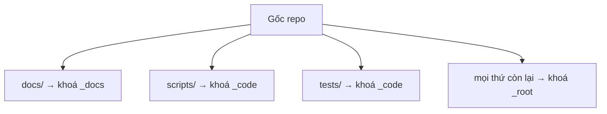

# Hướng dẫn

Hai người dùng, hai nhu cầu khác nhau. Đọc phần của mình.

## Đọc trang này thế nào — 60 giây

Trang có **bốn nhóm**, xếp theo *bạn đang cần gì*, không theo thứ tự viết ra.

| Nhóm | Mở khi nào | Ai đọc |
|---|---|---|
| **Tổng quan** | mỗi lần mở trang — **đúng ba câu**: đang làm gì · cần bạn làm gì · chỗ nào đang chặn | Đức |
| **Công việc** | muốn HÀNH ĐỘNG — việc chờ bạn chốt, ai đang giữ vùng nào, sổ nợ, hướng đang mở | Đức · AI |
| **Hệ thống** | muốn biết repo này CHẠY thế nào — làm mới bảng, cơ chế đa phiên, cấu trúc, lệnh | AI |
| **Lịch sử** | tra lại chuyện đã qua — quyết định, sổ phát hành, việc đã xong | AI · Đức |

**Bốn nhóm, không phải mười tab** — và mỗi khái niệm chỉ vẽ đầy đủ ở **một** chỗ; chỗ khác chỉ
một câu tóm tắt kèm liên kết. Lý do và cái mất: [ADR-0006](adr/0006-bang-mot-khai-niem-mot-cho.md).

**Nhóm Lịch sử không bao giờ sinh ra việc.** Viết `@Đức:bấm` trong sổ bàn giao thì bảng **không
thấy** — cố ý. Nhật ký là chỗ kể lại; giao việc thì viết vào sổ nợ.

Ba quy ước đọc, biết rồi thì không cần hỏi ai:

- **Đèn xanh chỉ khi cả ba số đều 0.** Dấu `?` nghĩa là *không đo được* — đó không phải số 0,
  và đèn sẽ không xanh.
- **Ô tô vàng là việc cần bạn**, không phải việc của AI.
- **Banner đỏ trên cùng** = trang quá bảy ngày tuổi, số trong đó đáng ngờ. Sinh lại rồi hãy tin.

Mục nào gập lại là mục **ít dùng** — bấm vào mới mở. Không gập là thứ dùng hằng ngày.

> Toàn bộ trang **sinh từ file trong repo**, không ai gõ tay. Muốn đổi chữ trên trang thì sửa
> file nguồn rồi sinh lại — sửa thẳng vào HTML là mất trắng ở lần sinh sau.

## Trước khi bắt đầu — 30 giây

**Máy bạn cần có:** Node.js và git. Kiểm bằng cách gõ `node -v` rồi `git --version` — ra số là
được. Bộ khung này được chạy thử trên Node `v24.18.0` và git `2.54.0`; Node từ bản 18 trở lên là
đủ.

**Không cần cài gì thêm.** Bộ khung không dùng thư viện ngoài, không gọi mạng, không cần tài
khoản hay khoá API. Mọi thứ chạy trên máy bạn. Cũng **không cần chạy `npm install`**.

**Gõ lệnh ở đâu:** mở Terminal (macOS) hoặc PowerShell (Windows), gõ `cd` rồi kéo thả thư mục
repo vào cửa sổ, Enter. Từ đó gõ các lệnh dưới đây.

**`<tên-phiên>` là gì:** một nhãn để máy biết ai đang chạy. Bạn gõ gì cũng được — `duc` là đủ.

**Nếu có gì đó đỏ mà bạn không sửa được:** copy nguyên văn dòng đỏ, dán cho AI, bảo nó *"sửa cái
này"*. Bạn không phải tự sửa.

## Cho người — chủ dự án

Bạn không cần đọc code. Ba câu hỏi dưới đây, mỗi câu một lệnh.

### "Repo này đang thế nào?"

```bash
npm run gate -- --as duc
```

**XANH TOÀN BỘ** thì việc đã xong. **ĐỎ** thì chưa xong — mỗi dòng đỏ nói luôn cách sửa.
**CHƯA ĐỦ BẰNG CHỨNG** thì cũng chưa xong, nhưng lý do khác: cổng chưa nhìn thấy được thứ nó
phải canh (thường là repo chưa khai bài kiểm tra). Cũng phải sửa, đừng bỏ qua.

### "Tôi cần duyệt những gì?"

Danh sách đầy đủ ở **[AGENTS.md mục 2 — Sáu việc PHẢI hỏi Đức trước](../AGENTS.md#2-sáu-việc-phải-hỏi-đức-trước)**.
Đó là **một bản duy nhất**, cố ý không chép lại ở đây — ba bản chép tay đã từng nói ba kiểu
khác nhau, và đó đúng là thứ nguy hiểm nhất trong cả tập tài liệu này.

### Ba dấu hiệu repo đang xuống cấp

- **Số chỗ VÀNG tăng dần mà không ai sửa.** Cảnh báo bị ngó lơ đủ lâu thì thành hình nền.
- **HANDOFF không được ghi.** Phiên sau sẽ làm lại việc phiên trước vừa làm.
- **Ai đó nới gate cho nó xanh.** Sửa bug thì được; gỡ bảo vệ thì không.

---

## Cho AI — phiên làm việc

*(Từ đây trở xuống là việc của AI. Đức không cần đọc.)*

### Mở phiên, đúng thứ tự

1. Đọc `AGENTS.md` → mục 6 (bản đồ file) → `HANDOFF.md` **phần cuối**
2. `claim` vùng mình sắp sửa. Vùng có chủ khác thì **chỉ đọc**
3. Chạy gate trước khi làm gì. Đỏ sẵn thì **dừng và báo**, đừng tự sửa cho nó xanh

### Trong lúc làm

**Một việc một lúc.** Việc phát sinh ngoài phạm vi thì ghi vào sổ, không tự làm.

**Mỗi fix một test ghim, và test phải dựng nổi ca hỏng.** Cách tự kiểm: phép kiểm nào nói
*"phải không có X"* thì tự hỏi — *dữ liệu giả tôi vừa dựng có tạo được ca CÓ X không?* Không tạo
được thì phép kiểm đó chỉ là đồ trang trí.

**Chạy mutation test trước khi báo xong** — cố ý phá code, xem test có đỏ không. Test không đỏ
nghĩa là nó chưa từng bảo vệ gì.

**Commit TRƯỚC khi chạy mutation test.** Bước khôi phục thường là `git checkout`, và nó xoá sạch
việc chưa commit đang được thử.

### Đóng phiên

**Thứ tự không đổi được, và nó có lưu đồ.** Làm theo
[workflows/03 — một phiên làm việc](workflows/03-mot-phien-lam-viec.md). Đừng chép quy trình đó
sang đây: một quy trình, một hình.

### Không bao giờ

- Báo xong khi gate chưa xanh
- Nới gate cho nó xanh
- `git push` trần — luôn dùng `npm run push`
- Tin `git status -sb` sau khi push. Hỏi thẳng máy chủ — cách hỏi nằm ở cuối
  [workflows/03](workflows/03-mot-phien-lam-viec.md)

## Repo chia vùng thế nào

Mỗi vùng chỉ một phiên AI được ghi tại một thời điểm. Bản đồ dưới đây là **ảnh chụp của repo
này** — nguồn thật là khối `areas` trong `.repo-structure.json`, và lệnh `node scripts/claim.mjs
--list` luôn nói đúng hơn hình vẽ.


